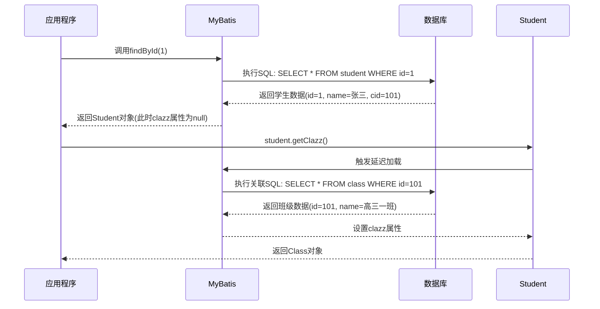

# MyBaits

## 1 MyBatis是什么

`MyBatis`是当下主流的ORM框架

ORM：Object Relationship Mapping 对象关系映射，可以理解为Java对象和数据库数据的映射，类和表的映射


上面是我的user表，相当于把我的类跟表映射起来了。把数据表中的一行数据封装成Java对象，所以我们可以通过Java去查。这就是ORM框架做的事情，可以说是把数据库表的行数据映射为Java对象，也可以说是把一个Java对象映射成了数据库表数据。

```java
package com.entity;
public class User {
    private Integer id;
    private String name;
    private Integer age;
    private Integer score;
    private Integer money;
}
```

ORM框架除了MyBaits还有MyBaits Plus、Spring Data JPA，以前用的是SSH、SSM，现在用的都是SpringBoot

SSH：Spring + Structs2 + Hibernate的组合

MyBaits是一个帮助开发者实现数据持久工作的框架，什么叫持久化工作，简单理解是把Java的数据拿到数据库中做一个增删改查，就是一个对JDBC进行封装的框架。

Hibernate是一个全自动化的框架，MyBaits是一个半自动化的框架。

Hibernate可以直接把类和表关联起来，执行一条SQL可以直接获取一个对象，初始化的时候会直接把一张表跟一个类关联起来，可以直接去掉它的方法，直接自动获取到对象。Hibernate虽然自动化很方便，但是不灵活。

全自动化是指开发者只需要调用相关的接口就可以完成操作，整个流程框架都已经封装好了，开发者无需关注。

半自动化是指框架只提供了一部分的功能，剩下的工作仍需要开发者来完成，MyBaits没有实现Java类和表的映射，但实现了SQL结果集和Java类的映射。同时需要开发者自定义SQL语句，以及结果集和Java对象的装配关系。

虽然半自动化的方式没有全自动化方便，但是它最大的优势是灵活性，MyBaits对所有的JDBC代码进行了封装，包括参数设置，SQL执行，结果集解析，通过XML配置的方式完成数据到Java对象的映射。

> MyBatis的优点

- 极大地简化了JDBC代码的开发
- 简单好用，容易上手，具有更好的灵活性
- 通过将SQL定义在XML文件中的方式降低程序的耦合度
- 支持动态SQL，可以根据具体的业务灵活实现需求

> MyBaits的缺点

- 相比较于Hibernate，开发者需要完成更多的工作，比如定义SQL、设置Java对象和数据的映射关系
- 要求开发人员具备一定的SQL编写能力，在一些特定场景下工作量较大
- 数据库移植性较差，因为SQL依赖于底层数据库，如果要进行数据库迁移，部分SQL可能需要重新编写

整体来讲，MyBaits是一款非常优秀的持久层解决方案，它专注于SQL本身，非常灵活，适用于需求变化较多的互联网项目，也是当下主流的ORM框架。

---

## 2 MyBaits的使用

使用Maven来管理jar包

1、创建Maven工程，pom.xml中添加相关依赖

```xml
<dependencies>
    <dependency>
        <groupId>org.mybatis</groupId>
        <artifactId>mybatis</artifactId>
        <version>3.5.4</version>
    </dependency>
    <dependency>
        <groupId>mysql</groupId>
        <artifactId>mysql-connector-java</artifactId>
        <version>8.0.33</version>
    </dependency>
</dependencies>
```

2、创建数据表

```sql
use test11;
create table user(
    id int primary key auto_increment,
    username varchar(11),
    password varchar(11),
    age int
);
```

3、创建实体类

```java
package com.test.entity;

public class User {
    private Integer id;
    private String username;
    private String password;
    private Integer age;

    public Integer getId() {
        return id;
    }

    public void setId(Integer id) {
        this.id = id;
    }

    public String getUsername() {
        return username;
    }

    public void setUsername(String username) {
        this.username = username;
    }

    public String getPassword() {
        return password;
    }

    public void setPassword(String password) {
        this.password = password;
    }

    public Integer getAge() {
        return age;
    }

    public void setAge(Integer age) {
        this.age = age;
    }

    @Override
    public String toString() {
        return "User{" +
                "id=" + id +
                ", username='" + username + '\'' +
                ", password='" + password + '\'' +
                ", age=" + age +
                '}';
    }
}
```

4、在resources路径下创建MyBaits配置文件config.xml（文件名可自定义）,配置数据源信息

数据库以及用户密码改成你自己的

```xml
<?xml version="1.0" encoding="UTF-8"?>
<!DOCTYPE configuration PUBLIC "-//mybatis.org//DTD Config 3.0//EN" "http://mybatis.org/dtd/mybatis-3-config.dtd">
<configuration>

    <!-- MyBatis运行环境 -->
    <environments default="development">
        <environment id="development">
            <!-- 配置JDBC事务管理 -->
            <transactionManager type="JDBC"></transactionManager>
            <!-- 配置JDBC数据源连接池 -->
            <dataSource type="POOLED">
                <property name="driver" value="com.mysql.cj.jdbc.Driver"/>
                <property name="url" value="jdbc:mysql://localhost:3306/dbname"/>
                <property name="username" value="root"/>
                <property name="password" value="root"/>
            </dataSource>
        </environment>
    </environments>

</configuration>
```

5、MyBatis开发有两种方式

- 使用原生接口
- Mapper代理实现自定义接口

### 2.1 原生接口

1、创建Mapper文件UserMapper.xml

```xml
<?xml version="1.0" encoding="UTF-8" ?>
<!DOCTYPE mapper PUBLIC "-//mybatis.org//DTD Mapper 3.0//EN" "http://mybatis.org/dtd/mybatis-3-mapper.dtd">
<!--namespace就是命名空间,把文件位置写出来就行 -->
<mapper namespace="com.test.mapper.UserMapper">
    <!--自定义SQL-->
    <select id="get" parameterType="Integer" 
            resultType="com.test.entity.User">
        <!--写SQL，id就是传进来的参数-->
        select * from  user where id = #{id}
    </select>
    
</mapper>
```

namespace通常设置为文件所在包 + 文件名，可以自定义，

parameterType为参数数据类型，resultType为返回数值数据类型

2、在全局配置文件config.xml中注册UserMapper.xml

```xml
<configuration>

    <!-- 注册UserMapper.xml -->
    <mappers>
        <mapper resource="com/test/mapper/UserMapper.xml"></mapper>
    </mappers>
    
</configuration>
```

为什么路径用“/"不用”.“  com/test/repository/UserRepository.xml"  ------>"com.test.entity.User"

因为UserRepository.xml有”.“，”.“是文件名的一部分，所以前面不能有”.“，不然文件层级逻辑错误。

3、在测试类中调用原生接口执行SQL语句获取结果

解决报错`Could not find resource com/test/mapper/UserMapper.xml`，没有权限，工程路径下的java里面的xml文件是不让访问的。则需要在 pom.xml 中设置允许读取 java 路径下的 XML 文件。

```xml
    <build>
        <resources>
            <resource>
                <directory>src/main/java</directory>
                <includes>
                    <include>**/*.xml</include>
                </includes>
            </resource>
            <resource>
                <directory>src/main/resources</directory>
                <includes>
                    <include>**/*.xml</include>
                </includes>
            </resource>
        </resources>
    </build>
```

`Test`

```java
package com.test.mapper;

import com.test.entity.User;
import org.apache.ibatis.session.SqlSession;
import org.apache.ibatis.session.SqlSessionFactory;
import org.apache.ibatis.session.SqlSessionFactoryBuilder;

import java.io.InputStream;

public class Test {
    public static void main(String[] args) {
        //加载MyBatis配置文件
        InputStream inputStream = Test.class.getClassLoader().getResourceAsStream("config.xml");
        SqlSessionFactoryBuilder sqlSessionFactoryBuilder = new SqlSessionFactoryBuilder();
        SqlSessionFactory sqlSessionFactory = sqlSessionFactoryBuilder.build(inputStream);
        //获取SqlSession
        SqlSession sqlSession = sqlSessionFactory.openSession();
        //调用MyBatis原生接口执行SQL
        String statement = "com.test.mapper.UserMapper.get";
        User user = sqlSession.selectOne(statement, 2);
        System.out.println(user);
    }
}
```

---

### 2.2 自定义接口

实际开发中，更推荐第二种方式：自定义接口，开发者不需要实现该接口，只需要定义即可，具体的实现工作由Mapper代理结合配置文件完成，实现逻辑（SQL语句）配置在Mapper.xml中即可。

1、自定义接口

```java
package com.test.repository;

import com.test.entity.User;

public interface UserRepository {
    public int add(User user);
    public int delete(Integer id);
    public int update(User user);
    public User getById(Integer id);

}
```

2、创建UserRepository.xml，定义接口方法对应的SQL语句，Statement标签根据SQL执行的业务可以选择insert、delete、update、select，MyBatis会根据规则自动创建UserRepository接口实现类的代理对象。

规则如下：

- UserRepository.xml中namespace为接口的全类名
- UserRepository.xml中的Statement的id为接口中对应的方法名
- UserRepository.xml中的Statement的parameter和接口中对应方法的参数类型一致
- UserRepository.xml中的Statement的resultType和接口中对应方法的返回值类型一致

`Statement标签`

```xml
<select id="get" parameterType="Integer"
        resultType="com.test.entity.User">
    <!--写SQL，id就是传进来的参数-->
    select * from  user where id = #{id}
</select>
```

`UserRepository.xml`

```xml
<?xml version="1.0" encoding="UTF-8" ?>
<!DOCTYPE mapper PUBLIC "-//mybatis.org//DTD Mapper 3.0//EN" "http://mybatis.org/dtd/mybatis-3-mapper.dtd">
<!--namespace就是命名空间,把文件位置写出来就行 -->
<mapper namespace="com.test.repository.UserRepository">
    <!--自定义SQL-->
    <insert id="add" parameterType="com.test.entity.User">
        insert into user(username,password,age) values
            (#{username},#{password},#{age})
    </insert>

    <delete id="delete" parameterType="java.lang.Integer">
        delete from user where id = #{id}
    </delete>

    <update id="update" parameterType="com.test.entity.User">
        update user set username = #{username},password = #{password},age =
            #{age} where id = #{id}
    </update>

    <select id="getById" parameterType="java.lang.Integer"
            resultType="com.test.entity.User">
        select * from user where id = #{id}
    </select>
</mapper>
```

3、在config.xml中注册UserRepository.xml

```xml
<?xml version="1.0" encoding="UTF-8"?>
<!DOCTYPE configuration PUBLIC "-//mybatis.org//DTD Config 3.0//EN" "http://mybatis.org/dtd/mybatis-3-config.dtd">
<configuration>


    <!-- 注册UserMapper.xml -->
    <mappers>
        <mapper resource="com/test/mapper/UserMapper.xml"></mapper>
        <mapper resource="com/test/repository/UserRepository.xml"></mapper>
    </mappers>
</configuration>
```

4、测试

```java
package com.test.mapper;

import com.test.entity.User;
import com.test.repository.UserRepository;
import org.apache.ibatis.session.SqlSession;
import org.apache.ibatis.session.SqlSessionFactory;
import org.apache.ibatis.session.SqlSessionFactoryBuilder;

import java.io.InputStream;

public class Test {
    public static void main(String[] args) {
        //加载MyBatis配置文件
        InputStream inputStream = Test.class.getClassLoader().getResourceAsStream("config.xml");
        SqlSessionFactoryBuilder sqlSessionFactoryBuilder = new SqlSessionFactoryBuilder();
        SqlSessionFactory sqlSessionFactory = sqlSessionFactoryBuilder.build(inputStream);
        //获取SqlSession
        SqlSession sqlSession = sqlSessionFactory.openSession();
        //获取实现接口的代理对象
        UserRepository userRepository = sqlSession.getMapper(UserRepository.class);

        //新增用户
//        User user = new User();
//        user.setUsername("李四");
//        user.setPassword("987654");
//        user.setAge(21);
//        System.out.println(userRepository.add(user));
//        sqlSession.commit();

        //查询用户
//        System.out.println(userRepository.getById(3));

        //修改用户
//        User user = userRepository.getById(3);
//        user.setUsername("王五");
//        user.setPassword("abc");
//        user.setAge(18);
//        System.out.println(userRepository.update(user));
//        sqlSession.commit();//除了查询都要提交

        //删除用户
        System.out.println(userRepository.delete(3));
        sqlSession.commit();
    }
}
```

---

## 3 配置文件详解

MyBatis有两类配置文件：

- 全局配置文件config.xml
- Mapper配置文件

全局配置文件主要用来定义数据源信息和一些基本配置，事务管理、打印SQL语句、开启二级缓存、设置延迟加载等。

Mapper配置文件（也叫映射文件，映射的是Java对象和数据的关系）的功能比较单一，定义对应接口的具体业务实现的SQL语句，Mapper配置文件一定要在全局配置文件中完成注册，否则MyBaits无法完成Mapper接口的实现。

MyBaits是一个半自动化的ORM框架，SQL语句需要开发者自定义，MyBaits关注的是Java对象和SQL之间的映射关系。

---

## 4 Mapper.xml常用属性

### 4.1 parameterType

参数数据类型

1、包装类数据类型，通过id查询USer

`UserRepository`接口

```java
public User getById(Integer id);
```

`UserRepository.xml`

```xml
<select id="getById" parameterType="java.lang.Integer"
        resultType="com.test.entity.User">
    select * from user where id = #{id}
</select>
```

2、String类型，通过name查询User

`UserRepository`接口

```java
public User getByUsername(String userName);
```

如果存在多个相同的name

```java
List<User> getByUsername(String username);
```

`UserRepository.xml`

```xml
<select id="getByUsername" parameterType="java.lang.String"
        resultType="com.test.entity.User">
    select * from user where username = #{username}
</select>
```

3、基本数据类型，通过age查询User

`UserRepository`接口

```java
public User getByAge(int age);
```

`UserRepository.xml`

```xml
<select id="getByAge" parameterType="int"
        resultType="com.test.entity.User">
    select * from user where age=#{age}
</select>
```

4、多个参数，通过username和age查询User，两个参数分别是String类型和int类型，类型不一致，所以parameterType可以省略，通过参数下标取出参数值

`UserRepository`接口

```java
public User getByUsernameAndAge(String username, int age);
```

`UserRepository.xml`

```xml
<select id="getByUsernameAndAge" resultType="com.test.entity.User">
    select * from user where username = #{param1} and age=#{param2}
</select>
```

5、Java对象，很显然当有多个参数的时候，一个一个写太麻烦了，这个时候我们可以将参数列表进行封装，将封装对象作为parameterType的值，比如把`String username, int age`这俩封装成一个对象

封装：`com.test.util.ParameterPOJO`

```java
package com.test.util;

public class ParameterPOJO {
    private String username;
    private int age;

    public String getUsername() {
        return username;
    }

    public void setUsername(String username) {
        this.username = username;
    }

    public int getAge() {
        return age;
    }

    public void setAge(int age) {
        this.age = age;
    }
}
```

`UserRepository`接口

```java
public User getByParameterPOJO(ParameterPOJO parameterPOJO);
```

`UserRepository.xml`

```xml
<select id="getByParameterPOJO" parameterType="com.test.util.ParameterPOJO"
        resultType="com.test.entity.User">
	select * from user where username = #{username} and age=#{age}
</select>
```

---

### 4.2 resultType

1、基本数据类型

`UserRepository`接口

```java
public int getCount();
```

`UserRepository.xml`

```xml
<select id="getCount" resultType="int">
	select count(*) from user
</select>
```

2、包装类、统计User总数

`UserRepository`接口

```java
public Integer getCountByInteger();
```

`UserRepository.xml`

```xml
<select id="getCountByInteger" resultType="java.lang.Integer">
    select count(*) from user
</select>
```

3、String类型 

`UserRepository`接口

```java
public String getUsernameById(Integer id);
```

`UserRepository.xml`

```xml
<select id="getUsernameById" parameterType="java.lang.Integer" resultType="java.lang.String" >
    select username from user where id=#{id}
</select>
```

4、Java对象

`UserRepository`接口

```java
public User getById(Integer id);
```

`UserRepository.xml`

```xml
<select id="getById" parameterType="java.lang.Integer"
        resultType="com.test.entity.User">
    select * from user where id = #{id}
</select>
```

---

## 5 级联查询

Hibernate不能做级联查询，只能跟一张表绑定。

实际开发中不可能只是对单表进行操作，一定会涉及到多表关联查询，数据表之间的关系有三种：

- 一对一关系。
- 一对多关系。
- 多对多关系。

实际开发中最常用的是一对多关系和多对多关系。

### 5.1 一对多

创建`user`表、`score`表

```sql
use test11;
create table user(
    id int primary key auto_increment,
    username varchar(11),
    password varchar(11),
    age int
);
create table score(
    id int primary key auto_increment,
    score int
);
```

取`user`表的id、username、age和`score`表的score封装成一个对象，这就是级联查询。

```java
package com.test.entity;

public class Demo {
    private Integer id;
    private String username;
    private Integer age;
    private Integer score;
}
```

创建`student`表和`class`表

```sql
use test11;
create table student(
    id int primary key auto_increment,
    name varchar(11),
    cid int
);
create table class(
    id int primary key auto_increment,
    name varchar(11)
);
```

**操作：查询student数据同时级联到对应的Class**

```sql
use test11;
select * from student,class where student.cid = class.id and student.id=1;
```

```sql
use test11;
#只取学生的id和名字以及班级
select student.id,student.name,class.name from student,class where student.cid = class.id and student.id=1;
```

```sql
use test11;
#换个名字
select student.id,student.name name,class.name classname from student,class where student.cid = class.id and student.id=1;
```

```sql
use test11;
#取别名
select s.id,s.name name,c.name classname from student s,class c where s.cid = c.id and s.id=1;
```

创建实体类`Student`

```java
package com.test.entity;

public class Student {
    private Integer id;
    private  String name;
    private String className;

    public Integer getId() {
        return id;
    }

    public void setId(Integer id) {
        this.id = id;
    }

    public String getName() {
        return name;
    }

    public void setName(String name) {
        this.name = name;
    }

    public String getClassName() {
        return className;
    }

    public void setClassName(String className) {
        this.className = className;
    }

    @Override
    public String toString() {
        return "Student{" +
                "id=" + id +
                ", name='" + name + '\'' +
                ", className='" + className + '\'' +
                '}';
    }
}
```

查学生，创建学生的接口`StudentRepository`

```java
package com.test.repository;

import com.test.entity.Student;

public interface StudentRepository {
    public Student getById(Integer id);
}
```

然后创建对应的mapper.xml，即`StudentRepository.xml`

```xml
<?xml version="1.0" encoding="UTF-8" ?>
<!DOCTYPE mapper PUBLIC "-//mybatis.org//DTD Mapper 3.0//EN" "http://mybatis.org/dtd/mybatis-3-mapper.dtd">
<!--namespace就是命名空间,把文件位置写出来就行 -->
<mapper namespace="com.test.repository.StudentRepository">
    <!--自定义SQL-->

    <select id="getById" parameterType="java.lang.Integer"
            resultType="com.test.entity.Student">
        select s.id,s.name name,c.name classname from student s,class c where
            s.cid = c.id and s.id=#{id};
    </select>
    
</mapper>
```

去全局配置文件config.xml注册

```xml
<configuration>
    <!-- 注册UserMapper.xml -->
    <mappers>
        <mapper resource="com/test/repository/StudentRepository.xml"></mapper>
    </mappers>
</configuration>
```

测试一下

```java
public class Test {
    public static void main(String[] args) {
        //加载MyBatis配置文件
        InputStream inputStream = Test.class.getClassLoader().getResourceAsStream("config.xml");
        SqlSessionFactoryBuilder sqlSessionFactoryBuilder = new SqlSessionFactoryBuilder();
        SqlSessionFactory sqlSessionFactory = sqlSessionFactoryBuilder.build(inputStream);
        //获取SqlSession
        SqlSession sqlSession = sqlSessionFactory.openSession();
        //获取实现接口的代理对象
        StudentRepository studentRepository = sqlSession.getMapper(StudentRepository.class);
        System.out.println(studentRepository.getById(2));
    }
}
```

上面写的并不是一个特别规范的级联查询，class的id是查不到的，所以更加规范的写法是每个表都要对应一个实体类。

重新改一下student类，把班级对象注入到student

```java
package com.test.entity;

public class Student {
    private Integer id;
    private  String name;
    private Class clazz; //把班级对象注入到student

    public Integer getId() {
        return id;
    }

    public void setId(Integer id) {
        this.id = id;
    }

    public String getName() {
        return name;
    }

    public void setName(String name) {
        this.name = name;
    }

    public Class getClazz() {
        return clazz;
    }

    public void setClazz(Class clazz) {
        this.clazz = clazz;
    }

    @Override
    public String toString() {
        return "Student{" +
                "id=" + id +
                ", name='" + name + '\'' +
                ", clazz=" + clazz +
                '}';
    }
}

```

要求：student数据里面级联到对应的Class

查到学生之后要把对应的班级带出来

class要把id和name封装起来成一个对象，再把对象映射到student的属性中

对结果集进行二次加工

注意！注意SQL语句的编写

```sql
use test11;
select s.id sid,s.name sname,c.name cname from student s,class c where s.cid = c.id and s.id=2;
```

这个SQL语句在数据库中运行是没有问题的，但是在MyBaits中无法映射到cid，要把cid也映射出来

```sql
use test11;
select s.id sid,s.name sname,c.id cid,c.name cname from student s,class c where s.cid = c.id and s.id=2;
```

在`StudentRepository.xml`文件中把id和name封装起来成一个class对象，再把对象映射到student的属性中

```java
<?xml version="1.0" encoding="UTF-8" ?>
<!DOCTYPE mapper PUBLIC "-//mybatis.org//DTD Mapper 3.0//EN"
        "http://mybatis.org/dtd/mybatis-3-mapper.dtd">
<!--namespace就是命名空间,把文件位置写出来就行 -->
<mapper namespace="com.test.repository.StudentRepository">
    <!--自定义SQL-->

    <resultMap id="studentMap" type="com.test.entity.Student">
        <id property="id" column="sid" ></id>
        <result property="name" column="sname"></result>
        <association property="clazz" javaType="com.test.entity.Class">
            <id property="id" column="cid"></id>
            <result property="name" column="cname"></result>
        </association>
    </resultMap>

    <select id="getById" parameterType="java.lang.Integer"
            resultMap="studentMap">
        select s.id sid, s.name sname, c.id cid, c.name cname
        from student s,
             class c
        where s.cid = c.id
          and s.id = #{id};
    </select>

</mapper>
```

实体类`Class`

```java
package com.test.entity;

public class Class {
    private Integer id;
    private String name;

    public Integer getId() {
        return id;
    }

    public void setId(Integer id) {
        this.id = id;
    }

    public String getName() {
        return name;
    }

    public void setName(String name) {
        this.name = name;
    }

    @Override
    public String toString() {
        return "Class{" +
                "id=" + id +
                ", name='" + name + '\'' +
                '}';
    }
}
```

查询Class,将级联的所有Studen一并查询，需注意添加实体类的 Getter、Setter 和 toString() 且正确。

---

### 5.2 多对多

多对多关系其实本质上就是双向的一对多关系，用Customer和Goods来举例，一个Customer可以对应多个Goods，一个Goods可以对应多个Customer

- 查customer对应的goods，买啥了
- 查goods对应的customer，谁买了

一定要记得去全局配置文件注册mapper

> github
>
> [级联查询：多对多之查customer对应的goods · qiuping01/MyBaits-Learn@b49a28f](https://github.com/qiuping01/MyBaits-Learn/commit/b49a28f412acdecc58f6efa5cf94a74683115d0b)
>
> [级联查询：多对多之查goods对应的customer，谁买了 · qiuping01/MyBaits-Learn@51284b3](https://github.com/qiuping01/MyBaits-Learn/commit/51284b34b1d55450133c96fb79c4c22fa024bdbe)

## 6 延迟加载

一种提高程序运行效率的技术：延迟加载，也叫惰性加载、懒加载

对于持久层操作有一个原则：Java程序和数据库交互次数越少越好，在确保完成业务逻辑的基础上，尽量减少Java程序和数据库的交互次数，以提高程序的整体运行效率，MyBaits提供的延迟加载就可以做到这一点。

让被级联的对象延迟加载。

Class 和 Student，当我们查询 Student 对象时，因为有级联关系，所以会将对应的 Class 对象一并查出，需要发送两条 SQL，分别查询 Class 和 Student 的数据。

延迟加载的思路：当我们查询 Student 的时候，如果没有调用 Class 属性，则只发送一条 SQL 语句查询 Student，如果需要调用 Class 属性，则发送两条 SQL 语句查询 Student 和 Class，所以延迟加载可以看做是一种优化机制，根据具体的代码，自动选择发送的 SQL 语句条数。

---

### 延迟加载执行流程：


---

```xml
<settings>
    <!-- 打印SQL -->
    <setting name="logImpl" value="STDOUT_LOGGING"/>
</settings>
```


只打印学生姓名和ID时，依旧加载了班级的sql


开启延迟加载：

只需要在config.xml中设置即可

```xml
<settings>
    <!-- 打印SQL -->
    <setting name="logImpl" value="STDOUT_LOGGING"/>
    <!-- 开启延迟加载 -->
    <setting name="lazyLoadingEnabled" value="true"/>
</settings>
```


## 7 MyBatis缓存机制

可以通过延迟加载减少Java程序和数据库的交互次数，从而提高程序的运行效率，但是延迟加载的功能并不全面，它只能在做级联查询的时候提高效率，如果现在的需求是单表查询，则延迟加载无法满足需求。此时可以使用缓存机制来提升程序的运行效率。

使用缓存的作用也是减少Java程序和数据库的交互次数，从而提高程序的运行效率。比如第一次查询出某个对象之后，MyBatis会自动将该对象存入缓存，当下一次查询同一个对象时，可以直接从缓存中取出，不必再次访问数据库。

MyBatis缓存共分为两类：一级缓存和二级缓存

一级缓存是MyBatis默认开启的缓存，并且不能关闭，即一级缓存永久存在，一级缓存是SqlSession级别的：一级缓存的作用域是SqlSession，当使用同一个SqlSession对象执行查询的时候，第一次的执行结果会自动存入SqlSession缓存，第二次查询时可以直接从缓存中获取。

但是如果是两个SqlSession查询两次同样的SQL，一级缓存不会生效，需要访问两次数据库。

为了保证数据的一致性，如果SqlSession执行了新增、删除、修改操作，MyBatis会自动清空SqlSession缓存中存储的数据。

一级缓存不需要进行任何的配置，可以直接使用。

MyBatis二级缓存是比一级缓存作用域更大的缓存机制，它是Mapper级别的，只要是同一个Mapper，无论使用多少个SqlSession来操作，数据都是共享的，多个共同的SqlSession可以共用二级缓存。

MyBatis二级缓存默认是关闭的，需要使用时可以通过配置手动开启。

以class为例

二级缓存使用：

1.实体类实现序列化接口

2.全局配置文件config.xml开启二级缓存

```xml
<settings>
    <!-- 开启二级缓存 -->
    <setting name="cacheEnabled" value="true"/>
</settings>
```

3.Mapper文件声明

```xml
<cache></cache>
```

---

## 8 动态SQL

MyBatis是一个半自动化的ORM框架，需要开发者手动定义SQL，在业务需求比较复杂的情况下，手动拼接SQL的工作量就会非常大，为了适用不同的情况，需要做很多的重复性工作，出错率很高。

为了解决这一问题，MyBatis提供了动态SQL，可以根据具体的业务逻辑动态拼接SQL语句，极大地简化了开发者的工作量，开发者只需要定义一个具体的模版，然后添加特定的业务逻辑，MyBatis框架就可以自动生成不同的SQL语句，以应对各种不同的需求，使用起来非常简单方便。

进行优化，判断User对象，如果password值不为null，SQL就添加password的判断，如果password为null，则不添加password的判断。

### 8.1 if标签

```xml
<?xml version="1.0" encoding="UTF-8" ?>
<!DOCTYPE mapper PUBLIC "-//mybatis.org//DTD Mapper 3.0//EN"
        "http://mybatis.org/dtd/mybatis-3-mapper.dtd">
<!--namespace就是命名空间,把文件位置写出来就行 -->
<mapper namespace="com.test.repository.UserRepository">
    <!--自定义SQL-->
    <select id="get" parameterType="com.test.entity.User"
            resultType="com.test.entity.User">
        select * from user
        <where>
            <if test="id != null">
                id = #{id}
            </if>
            <if test="username != null">
                and username = #{username}
            </if>
            <if test="password != null">
                and password = #{password}
            </if>
            <if test="age != null">
                and age = #{age}
            </if>
        </where>
    </select>


</mapper>
```

```java
//获取实现接口的代理对象
UserRepository repository = sqlSession.getMapper(UserRepository.class);
User user = new User();
user.setId(1);
//user.setUsername("张三");
user.setPassword("123");
user.setAge(22);
User user1  =repository.get(user);
System.out.println(user1);
```

### 8.2 choose when标签

新版本只能取一个，有一个符合后面的when就不看了

```xml
<select id="get" parameterType="com.test.entity.User"
        resultType="com.test.entity.User">
    select * from user
    <where>
       <choose>
           <when test="id != null">
               id = #{id}
           </when>
           <when test="username != null">
               and username = #{username}
           </when>
           <when test="password != null">
               and password = #{password}
           </when>
           <when test="age != null">
               and age = #{age}
           </when>
       </choose>
    </where>
</select>
```

choosewhen逻辑和if类似，但是区别在于choosewhen如果发现某个条件符合逻辑判断，添加了对应的SQL语句后，后续的when逻辑块就不再判断，也不会添加，使用choosewhen最终的SQL一定是单条件判断，只适用于单条件判断能够查询出合理的结果的业务场景，而不适用于单条件同时查询出多个结果的业务场景。

### 8.3 set标签

set标签用于update操作，会自动根据参数选择生成SQL语句。

```xml
<update id="update" parameterType="com.test.entity.User">
    update user
    <set>
        <if test="username !=null">
            username = #{username},
        </if>
        <if test="password !=null">
            password = #{password},
        </if>
        <if test="age !=null">
            age = #{age},
        </if>
    </set>
    where id = #{id}
</update>
```

### 8.4 foreach标签

foreach标签可以迭代生成一系列值，主要用于SQL的in查询。

```xml
<select id="getByIds" parameterType="java.lang.Integer"
        resultType="com.test.entity.User">
    select * from user
    <!--遍历ids-->
    <where>
        <foreach collection="ids" item="id" open="id in (" close=")"
                 separator=",">
            #{id}
        </foreach>
    </where>
</select>
```

MyBatis 是一个半自动化的 ORM 框架，每次操作都需要在 Mapper.xml 中定义 SQL 语句以及 Java 对象的映射关系，使用这种方式进行开发，代码的扩展性较差，可以通过动态 SQL 机制来解决这一问题，提高代码的灵活性和扩展性。

---

## 9 MyBatis Plus

在 MyBatis 框架的基础上进行了业务的扩展，国产框架，二次开发，自动生成 SQL 语句。

基于springboot框架，不用引入依赖，springboot自动整合构建环境。

spring框架，springboot框架，springcloud框架。
